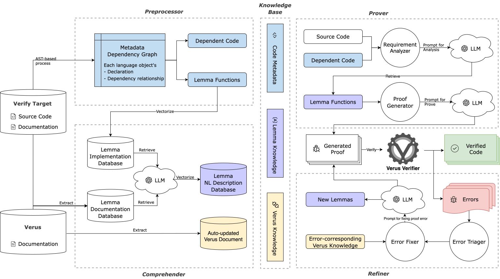

# KVerus

Scalable and Resilient Formal Verification Proof Generation for Rust Code



KVerus is a practical LLM-assisted workflow for generating Verus proofs in evolving Rust repositories. It targets repository-scale verification tasks where a proof may depend on specifications, traits, type aliases, helper functions, and project-specific lemmas spread across multiple files. 
To bridge this semantic-structural gap, KVerus builds a dynamic knowledge base over code metadata, lemma semantics, and Verus/toolchain knowledge; extracts dependency-scoped context for each target; retrieves reusable lemmas from project code and Verus libraries; and iteratively refines generated proof code using verifier diagnostics. 

For more details, see our [preprinted paper](https://arxiv.org/abs/2605.03822), accepted at [ASE 2026](https://conf.researchr.org/home/ase-2026).


## Setup Environment

You can set up the environment using the provided Dockerfile, or follow these manual steps:

#### 0. Clone the Repo
```shell
$ git clone -b ase-26 --recursive https://github.com/asterinas/KVerus.git
```

#### 1. Prepare the python environment

If you don't have uv installed, please follow the [official instructions](https://docs.astral.sh/uv/getting-started/installation/).

```shell
# sync python environment
uv sync

# activate python environment
# Linux/macOS:
source .venv/bin/activate
```

#### 2. Install Verus

KVerus depends on the [Verus](https://github.com/verus-lang/verus/) command-line tool. 
You can use the Verus accompanied with one evaluation database, which is provided in `database/CortenMM`.
Please run the following commands to install it.

```bash
$ ./database/CortenMM/fetch.sh
```

#### 3. Build the preprocess binary:

```shell
$ ./scripts/setup.sh
```

## Generate Proof for Verus

KVerus is manipulated through command line interface `KVerus.py`. It includes four subcommands: `preprocess`, `comprehend`, `prove`, and `fix`. To learn how to use each subcommand, you can run `python ./KVerus.py [subcommand] --help`. Additionally, KVerus requires the creation of two configuration files: `config.toml` and `fvts.toml`. The `config.toml` file is used to configure the behavior of KVerus, while the `fvts.toml` file is used to specify the FVTs that need to be verified.

Here’s how you can use KVerus with the CortenMM as an example:

#### 1. **Configure KVerus.** 

Use the interactive CLI to create a working configuration. Have your API keys or local LLM endpoints ready—KVerus typically requires **two models**: **one for reasoning** and **one for embedding**. The wizard will generate a `config.toml`. For detailed field meanings, see the comments in [`config.template.toml`](./config.template.toml)

```bash
# Recommended: guided setup that writes config.toml
$ python ./KVerus.py config setup
```

Afterwards, you can modify the configuration using the `config` command.

**Alternative (manual) setup**

You may copy the template and edit it by hand. If you choose this path, ensure **every** option marked `[MODIFY THIS]` is present and correctly set. This approach is for advanced users and is not recommended for first-time setup.

#### 2. **Configure the FVT.** We have prepared a configuration for `CortenMM` at `database/CortenMM/fvt.toml`, which can be directly utilized. 

If you want to do this manually, copy the `fvts.template.toml` file to `fvts.toml` and modify the configuration settings for the crate. Ensure that all options marked with `[MODIFY THIS]` are included. Refer to the comments in the [template file](./fvts.template.toml) for more details.

#### 3. **Preprocess.** Run preprocessor to extract necessary information from the library.

You can run the following command to preprocess the `vstd` library

```shell
$ python ./KVerus.py -D -F ./database/vstd/fvts.toml preprocess -F vstd
```

#### 4. **Comprehend.** 
Run `comprehend` to generate vector database
```shell
$ python ./KVerus.py -D -F ./database/vstd/fvts.toml comprehend -F vstd
```

#### 5. **Prove.**  
 - Run `prove` to run the proof task.
    To prove `admit()`:
    ```bash
    $ python ./KVerus.py -D -F ./database/CortenMM/fvt.toml prove --fvt lock-protocol admit --file ./database/CortenMM/lock-protocol/src/spec/utils.rs
    ```
    To fix the proof error:
    ```bash
    $ python ./KVerus.py -D -F ./database/CortenMM/fvt.toml prove --fvt lock-protocol fix
    # Optional: provide a patch/diff as extra context without applying it
    $ python ./KVerus.py -D -F ./database/CortenMM/fvt.toml prove --fvt lock-protocol fix --patch-file ./local_changes.diff
    ```
    To prove a single file:
    ```bash
    $ python ./KVerus.py -D -F ./database/Verus-Bench/fvts.toml prove --fvt single single --file database/Verus-Bench/code/unverified/two_sum.rs
    ```
    To prove all single files in a dir (configured in the `crate_path` of fvts.toml):
    ```bash
    $ python ./KVerus.py -D -F ./database/Verus-Bench/fvts.toml prove --fvt Verus-Bench all -o ./database/Verus-Bench/out/Verus-Bench
    ```

## Simplify the Generated Proof

KVerus provides a `simplify` command to clean up and simplify the generated Verus proof code. This can help in removing unnecessary annotations (i.e., `assert`).

```bash
# Simplify the proof for a specific FVT
$ python ./KVerus.py -D -F ./database/CortenMM/fvts.toml simplify --fvt ostd

# Enable deep cleaning
$ python ./KVerus.py -D -F ./database/CortenMM/fvts.toml simplify --fvt ostd --deep-clean

# Filter functions to simplify by location string
$ python ./KVerus.py -D -F ./database/CortenMM/fvts.toml simplify --fvt ostd --filter "path/to/file.rs"
```

## Cite
If you find KVerus useful in your research, please consider citing our ASE 2026 paper:
```
@article{liu2026kverus,
  title={KVerus: Scalable and Resilient Formal Verification Proof Generation for Rust Code},
  author={Liu, Yuwei and Wan, Xinyi and Wang, Yanhao and Wang, Minghua and Huang, Lin and Wei, Tao},
  journal={arXiv preprint arXiv:2605.03822},
  year={2026}
}
```